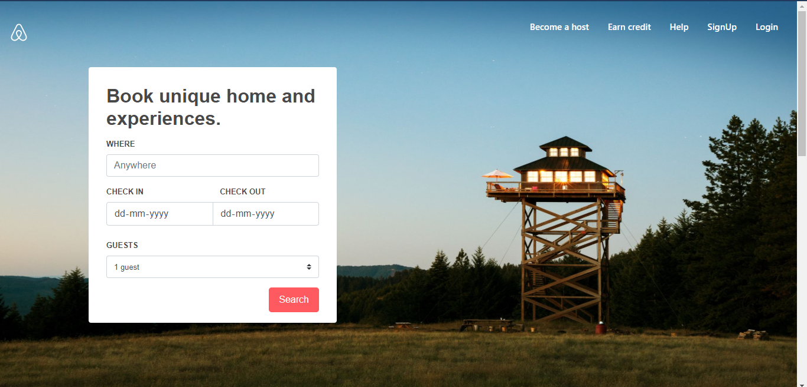

# Airbnb Clone #

### A clone of Airbnb website done using HTML and CSS and Bootstrap 4. ###

The website that we are about to clone is https://airbnb.com

This is a demo project for understanding how to use HTML, CSS and Bootstrap to build a website of your own.

#### raw.html ####
- is a HTML page that uses only HTML, no CSS is involved.

#### inline.html ####
- is a HTML page that uses HTML along with inline CSS.

#### internal.html ####
- is similar to inline.html, but all styling is maintained in head section using style tag.

#### airbnb_external.html ####
- is a file which uses HTML, external css is used & named as "style.css" and linked using link tag in head section of the file.

#### bootstrap.html ####
- is a file which uses HTML, external css is used & named as "custom.css" and bootstrap 4 which gives the real feel of the website looks.

The Final Cloned Website Looks As Follows : 

